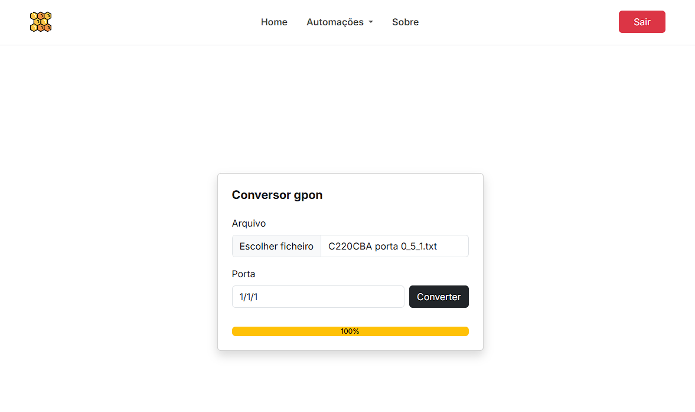

# 🐝 Honeycomb

Production-grade Django automation platform powered by Celery background workers.

Built and actively used by a real telecom company in Brazil.

## Screenshot

<div align="center">
  <p float="left">
    
  </p>
</div>

## Getting Started

### 1️⃣ Clone the repository

```bash
git clone https://github.com/AppRonin/honeycomb-django.git
cd honeycomb-django
```

### 2️⃣ Create Virtual Environment

```bash
python -m venv venv
source env/bin/activate
```

### 3️⃣ Install Dependencies

```bash
pip install -r requirements.txt
```

### 4️⃣ Environment Variables Setup

```bash
SECRET_KEY=your-secret-key
DEBUG=True

DB_NAME=honeycomb_db
DB_USER=postgres
DB_PASSWORD=yourpassword
DB_HOST=localhost
```

### 5️⃣ Run Services

Start Redis:

```bash
sudo service redis-server start
```

Start Django:

```bash
python manage.py runserver
```

Start Celery:

```bash
celery -A config worker -l info
```

## Author

Developed by **AppRonin**, Full-Stack Developer.
